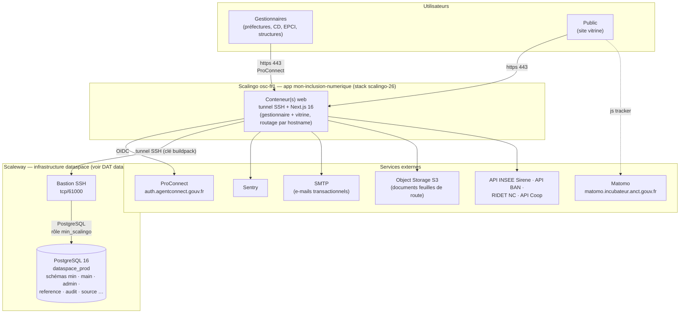
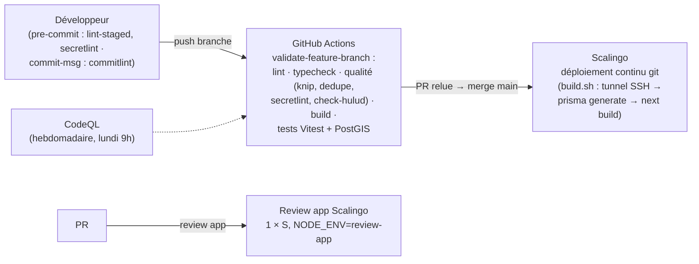

# Dossier d'architecture technique — Mon Inclusion Numérique

> Ce document décrit l'architecture technique de **Mon Inclusion Numérique (MIN)**, l'application
> de gestion de l'inclusion numérique portée par la Société Numérique de l'ANCT, et de son site
> vitrine. Il n'est ni un guide d'installation (voir [CONTRIBUTING.md](../CONTRIBUTING.md)) ni une
> documentation du code (voir la Discussion GitHub #202 et [`docs/adr/`](adr/)).
>
> MIN est l'interface applicative du **Data Space Société Numérique** : les deux produits
> partagent la même base de données. Tout ce qui relève de la base partagée, de
> l'infrastructure Scaleway, des pipelines de données, des sauvegardes et du registre complet
> des données est décrit dans le **[DAT du dataspace](https://gitlab.com/incubateur-territoires/startups/data-space-societe-numerique/scripts/-/blob/main/docs/architecture-technique.md)**,
> auquel ce document renvoie.

|                               |                                                                                                                                                                                                                                                  |
| ----------------------------- | ------------------------------------------------------------------------------------------------------------------------------------------------------------------------------------------------------------------------------------------------ |
| **Nom du projet**             | Mon Inclusion Numérique (MIN) + site vitrine inclusion-numerique.anct.gouv.fr                                                                                                                                                                    |
| **Dépôt applicatif**          | GitHub — `anct-cnum/suite-gestionnaire-numerique` (ce dépôt), licence AGPL-3.0                                                                                                                                                                   |
| **Produit data associé**      | Data Space Société Numérique — GitLab `incubateur-territoires/startups/data-space-societe-numerique` ([DAT](https://gitlab.com/incubateur-territoires/startups/data-space-societe-numerique/scripts/-/blob/main/docs/architecture-technique.md)) |
| **Hébergeur applicatif**      | Scalingo — région `osc-fr1` (France), app `mon-inclusion-numerique`, stack `scalingo-26` (bascule le 31/08/2026)                                                                                                                                 |
| **Hébergeur base de données** | Scaleway (via le dataspace) — la base n'est **pas** hébergée chez Scalingo                                                                                                                                                                       |
| **SecNumCloud**               | Scalingo : oui (offre qualifiée) ; base de données Scaleway : non                                                                                                                                                                                |
| **Décision d'homologation**   | _À compléter_                                                                                                                                                                                                                                    |
| **Suivi des tickets**         | GitHub Project « SEPT - Board » (`anct-cnum`, produit _Mon Inclusion Numérique_)                                                                                                                                                                 |
| **Dernière mise à jour**      | 31 août 2026                                                                                                                                                                                                                                     |

## Sommaire

- [Suivi du document](#suivi-du-document)
- [Fiche de contrôle](#fiche-de-contrôle)
- [Description du projet](#description-du-projet)
- [Architecture](#architecture)
  - [Stack technique](#stack-technique)
  - [Schéma de l'architecture](#schéma-de-larchitecture)
  - [Matrice des flux](#matrice-des-flux)
  - [Inventaire des dépendances](#inventaire-des-dépendances)
  - [Gestion DNS](#gestion-dns)
  - [Schéma des données](#schéma-des-données)
  - [Environnements, CI/CD et déploiement](#environnements-cicd-et-déploiement)
- [Exigences générales](#exigences-générales)
  - [Accès aux serveurs et sécurité des échanges](#accès-aux-serveurs-et-sécurité-des-échanges)
  - [Détection de fuite de secrets](#détection-de-fuite-de-secrets)
  - [Authentification, contrôle d'accès, habilitations et profils](#authentification-contrôle-daccès-habilitations-et-profils)
  - [Traçabilité des erreurs et des actions](#traçabilité-des-erreurs-et-des-actions)
  - [Politique de mise à jour des applicatifs](#politique-de-mise-à-jour-des-applicatifs)
  - [Détection des vulnérabilités](#détection-des-vulnérabilités)
  - [Intégrité et sauvegardes](#intégrité-et-sauvegardes)
  - [Confidentialité](#confidentialité)
  - [Registre des données](#registre-des-données)
  - [Bonnes pratiques de sécurité au sein de l'équipe](#bonnes-pratiques-de-sécurité-au-sein-de-léquipe)
- [Dette technique et points d'attention connus](#dette-technique-et-points-dattention-connus)

---

## Suivi du document

Le document est versionné avec le code, dans `docs/` de ce dépôt. Toute évolution structurante
(nouveau service externe, changement d'hébergement, nouveau flux de données à caractère
personnel, changement de stack) doit donner lieu à une mise à jour via une PR.

Sources de vérité utilisées pour cette version : ce dépôt à la révision `b64e692d`
(post-montée Next 16 / Prisma 7 du 28-31/08/2026), `Procfile`, `build.sh`, `.buildpacks`,
`scalingo.json`, `.github/workflows/`, `prisma/schema.prisma` et `prisma/migrations/`,
`docs/integration-dataspace.md`, `docs/audit-droits-bdd.md`, et le
[DAT du dataspace](https://gitlab.com/incubateur-territoires/startups/data-space-societe-numerique/scripts/-/blob/main/docs/architecture-technique.md)
du 27/08/2026 pour la partie base de données et infrastructure Scaleway.

## Fiche de contrôle

| Organisme                        | Nom                  | Rôle             | Activité  |
| -------------------------------- | -------------------- | ---------------- | --------- |
| ANCT — prestataire               | Philippe Martinez    | Développeur data | Rédaction |
| ANCT — prestataire               | Adrien Turpin        | Développeur data | Relecture |
| ANCT — prestataire               | Adrien Risser-Zhuang | Développeur data | Relecture |
| ANCT — prestataire               | Ornella Ourfi        | Développeur data | Relecture |
| ANCT                             | Kévin Troadec        | Product Owner    | Relecture |
| ANCT                             | Ferdinand Rautureau  | Chef de projet   | Relecture |
| Incubateur de l'ANCT — beta.gouv | Olivier Laurendeau   | Deputy CTO       | Relecture |

## Description du projet

Mon Inclusion Numérique est l'application web des **gestionnaires de l'inclusion numérique**
(préfectures, conseils départementaux, EPCI, structures, groupements) : gouvernances
départementales, feuilles de route, plans d'action et financements, membres, suivi des postes
de conseillers numériques, statistiques d'accompagnement, et outils d'administration des
données du dataspace (fusion de doublons de structures, revue des appariements de lieux).

Le même déploiement sert **deux sites** :

- l'**outil gestionnaire** sur `mon.inclusion-numerique.anct.gouv.fr`, accessible après
  authentification **ProConnect** ;
- le **site vitrine public** sur `inclusion-numerique.anct.gouv.fr` (données territoriales de
  l'inclusion numérique), routé par hostname dans `src/proxy.ts`.

Techniquement, MIN est une application **Next.js (App Router) / React / TypeScript** en clean
architecture (domain / use-cases / gateways / presenters, frontière imposée par ESLint),
utilisant le **DSFR**, hébergée sur **Scalingo**, et connectée via **Prisma** à la base
PostgreSQL **partagée avec le dataspace** (hébergée chez Scaleway, jointe par tunnel SSH).
MIN ne possède que le schéma `min` ; les données métier (`main`, `admin`, `reference`) sont
produites par les pipelines du dataspace. Le code est libre (AGPL-3.0), la documentation en
français.

---

## Architecture

### Stack technique

| Brique                              | Rôle                                                                                                     | Version (prod)                       |
| ----------------------------------- | -------------------------------------------------------------------------------------------------------- | ------------------------------------ |
| **Next.js** (App Router)            | framework web : pages serveur, server actions, routes API                                                | 16.3.3 (pin exact)                   |
| **React / React DOM**               | UI                                                                                                       | 19.x                                 |
| **TypeScript**                      | langage (mode `strict`)                                                                                  | 5.9                                  |
| **Node.js**                         | runtime                                                                                                  | 22.14.0 (`engines` exact + `.nvmrc`) |
| **pnpm**                            | gestionnaire de paquets                                                                                  | 10.12.1 (`packageManager`)           |
| **Prisma**                          | ORM (schémas `min`, `main`, `admin`, `reference` ; `prisma.config.ts`, client généré `prisma/generated`) | 7.10                                 |
| **NextAuth**                        | authentification OIDC (provider unique ProConnect)                                                       | 4.24                                 |
| **DSFR** + react-dsfr               | design système de l'État                                                                                 | 1.15 / 1.32                          |
| **Sentry** (`@sentry/nextjs`)       | suivi des erreurs client/serveur/edge                                                                    | 10.71                                |
| **nodemailer + MJML**               | e-mails transactionnels (invitations, labellisation) via SMTP                                            | 9.0 / 5.4                            |
| **AWS SDK S3**                      | stockage objet des documents de feuilles de route                                                        | 3.x                                  |
| **maplibre-gl**, chart.js, recharts | cartes et graphiques de la vitrine et des statistiques                                                   | —                                    |
| **Scalingo**                        | PaaS : buildpacks `ssh-private-key` + `nodejs`, stack `scalingo-26`                                      | —                                    |

Choix structurants :

- **Application sans état** : aucune base de données ni cache chez Scalingo (pas d'addon).
  Toute la persistance est dans la base partagée du dataspace, plus un bucket S3 pour les
  documents. Les conteneurs sont jetables.
- **Tunnel SSH intégré au cycle de vie** : le process `web` (Procfile) et le build
  (`build.sh`) commencent par ouvrir un tunnel SSH vers le bastion du dataspace avant de
  lancer Next.js — la base n'est jamais exposée sur Internet.
- **Clean architecture + CQRS** : entités immuables dans `src/domain/`, commandes/queries dans
  `src/use-cases/`, implémentations Prisma et API dans `src/gateways/`, présentation pure dans
  `src/presenters/` ; dépendances entre couches vérifiées par ESLint
  (`import/no-restricted-paths`). Erreurs métier par type `Result`, sans exception.
- **Pas de migrations Prisma en production** : `prisma migrate deploy` est désactivé ; le
  schéma `min` évolue par migrations Prisma rejouées en dev/CI, la production étant migrée en
  coordination avec les migrations Flyway du dataspace
  ([docs/integration-dataspace.md](integration-dataspace.md)).

### Schéma de l'architecture

#### Vue d'ensemble

#### Chaîne CI/CD et déploiement

### Matrice des flux

#### Flux entrants

| Source        | Destination                            | Protocole / port | Authentification                        | Commentaire                                                   |
| ------------- | -------------------------------------- | ---------------- | --------------------------------------- | ------------------------------------------------------------- |
| Gestionnaires | `mon.inclusion-numerique.anct.gouv.fr` | HTTPS 443        | ProConnect (OIDC), session JWT NextAuth | routage TLS par Scalingo                                      |
| Public        | `inclusion-numerique.anct.gouv.fr`     | HTTPS 443        | aucune                                  | vitrine servie par le même déploiement (rewrite `/vitrine/*`) |
| Supervision   | `/api/health`                          | HTTPS 443        | aucune                                  | `SELECT 1` via Prisma, 200/503                                |

#### Flux sortants

| Destination                                             | Protocole                                 | Authentification                                                        | Usage                                                                                                                     |
| ------------------------------------------------------- | ----------------------------------------- | ----------------------------------------------------------------------- | ------------------------------------------------------------------------------------------------------------------------- |
| Bastion dataspace (Scaleway) puis base `dataspace_prod` | SSH tcp/61000 + PostgreSQL dans le tunnel | clé SSH « Scalingo - MIN » (buildpack) ; rôle PostgreSQL `min_scalingo` | toutes les lectures/écritures applicatives (Prisma)                                                                       |
| `auth.agentconnect.gouv.fr` (ProConnect)                | HTTPS                                     | client id/secret OIDC                                                   | authentification des gestionnaires                                                                                        |
| Sentry (DSN)                                            | HTTPS                                     | DSN                                                                     | remontée d'erreurs et traces                                                                                              |
| Serveur SMTP (deux comptes : standard et super-admin)   | SMTP                                      | login/mot de passe                                                      | invitations, confirmations de labellisation                                                                               |
| Object Storage S3 (`S3_ENDPOINT`)                       | HTTPS S3                                  | clés d'accès                                                            | documents des feuilles de route (upload/download)                                                                         |
| `api.insee.fr/api-sirene/3.11`                          | HTTPS                                     | clé `INSEE_API_KEY`                                                     | fiche établissement à la saisie d'un SIRET                                                                                |
| `data.geopf.fr/geocodage`                               | HTTPS                                     | —                                                                       | géocodage BAN des adresses saisies                                                                                        |
| `data.gouv.nc` (RIDET)                                  | HTTPS                                     | —                                                                       | établissements de Nouvelle-Calédonie                                                                                      |
| `coop-numerique.anct.gouv.fr/api/v1`                    | HTTPS                                     | Bearer `COOP_TOKEN`                                                     | statistiques Coop — **flux de repli** (`COOP_STATS_SOURCE=api`), la lecture par défaut passe par la base partagée (#1793) |

Les flux internes à l'hébergement Scaleway (bastion, ACL de la base, autres consommateurs)
sont décrits dans la matrice des flux du DAT du dataspace.

### Inventaire des dépendances

| Applicatif                                                                                         | Service              | Version (prod)                                       | Commentaires                                                                                    |
| -------------------------------------------------------------------------------------------------- | -------------------- | ---------------------------------------------------- | ----------------------------------------------------------------------------------------------- |
| Scalingo                                                                                           | PaaS                 | stack `scalingo-26` (31/08/2026)                     | buildpacks `ssh-private-key-buildpack` + `nodejs-buildpack` (non épinglés — branche par défaut) |
| Node.js                                                                                            | runtime              | 22.14.0                                              | épinglé (`engines`, `.nvmrc`, CI)                                                               |
| Next.js                                                                                            | framework            | 16.3.3                                               | pin exact ; montée 15 → 16 le 28/08/2026 (#1856)                                                |
| Prisma                                                                                             | ORM                  | 7.10                                                 | `prisma.config.ts`, generator `prisma-client` (sortie `prisma/generated`)                       |
| PostgreSQL                                                                                         | base partagée        | 16 (managée Scaleway)                                | voir DAT dataspace (instance `dataspaceprod`)                                                   |
| NextAuth                                                                                           | auth                 | 4.24                                                 | provider OIDC ProConnect uniquement                                                             |
| Sentry                                                                                             | erreurs              | SDK 10.71                                            | SaaS                                                                                            |
| Matomo                                                                                             | analytics            | instance `matomo.incubateur.anct.gouv.fr`, siteId 27 | chargé uniquement en production, mode exempté de consentement                                   |
| ESLint 9 · Prettier 3 · Stylelint 16 · Knip 5 · Secretlint 13 · Stryker 8 · Storybook 9 · Vitest 3 | outillage qualité    | —                                                    | pre-commit + CI                                                                                 |
| Devbox / Docker Compose                                                                            | environnement de dev | PostGIS 16-3.5 + pgvector 0.8, Mailpit, MinIO        | dev local uniquement                                                                            |

L'inventaire exhaustif des paquets npm est dans `package.json` / `pnpm-lock.yaml`
(Dependabot hebdomadaire, groupe minor-and-patch).

### Gestion DNS

La zone **`inclusion-numerique.anct.gouv.fr`** est déléguée aux serveurs de noms Scaleway et
gérée manuellement — voir la section « Gestion DNS » du DAT du dataspace (y compris le point
d'attention sur le projet Scaleway hébergeant la zone). Pour MIN :

- apex `inclusion-numerique.anct.gouv.fr` (vitrine) et `mon.inclusion-numerique.anct.gouv.fr`
  (outil gestionnaire) pointent vers l'app Scalingo (URL canonique
  `mon-inclusion-numerique.osc-fr1.scalingo.io`) ;
- les certificats TLS de ces domaines sont gérés par Scalingo (Let's Encrypt).

### Schéma des données

La base est décrite en détail dans le DAT du dataspace (section « Schéma des données »). Du
point de vue de MIN :

| Schémas                                      | Propriétaire                                           | Usage par MIN                                                                                                                                                                                             |
| -------------------------------------------- | ------------------------------------------------------ | --------------------------------------------------------------------------------------------------------------------------------------------------------------------------------------------------------- |
| `min`                                        | **MIN** (migrations Prisma, 28 migrations versionnées) | modèle applicatif : utilisateurs, gouvernances, feuilles de route, actions, membres, comités, transferts de membres, vues `personne_enrichie` et `postes_conseiller_numerique_synthese`                   |
| `main`, `admin`, `reference`                 | dataspace (Flyway)                                     | lecture des données réconciliées (structures, lieux, personnes, postes, territoires) + **écritures ciblées** accordées par grants Flyway (fusions de doublons, appariements de lieux, édition d'identité) |
| `audit`, `source`                            | dataspace                                              | MIN alimente `source.min__evenements` (journalisation) et lit `audit.structure_merge_log`                                                                                                                 |
| `api`, `auth`, `dataviz`, `opendata`, `llm`… | dataspace                                              | non utilisés par MIN                                                                                                                                                                                      |

Le schéma Prisma (`prisma/schema.prisma`, 47 modèles + 2 vues) couvre les quatre schémas
`min`, `main`, `admin`, `reference` ; la migration `dataspace_integration` (régénérée par
`pnpm db:sync-dataspace`) reconstruit en local la partie possédée par le dataspace.

### Environnements, CI/CD et déploiement

| Environnement | Application                                                     | Base                                                                   | Usage                                                         |
| ------------- | --------------------------------------------------------------- | ---------------------------------------------------------------------- | ------------------------------------------------------------- |
| Production    | Scalingo `mon-inclusion-numerique` (osc-fr1, stack scalingo-26) | `dataspace_prod` (Scaleway, tunnel SSH)                                | réel ; Matomo actif, `prisma migrate deploy` désactivé        |
| Review apps   | Scalingo, 1 conteneur `web` taille S par PR                     | _(selon configuration Scalingo)_                                       | validation visuelle des PRs ; `SENTRY_ENVIRONMENT=review-app` |
| CI            | GitHub Actions `ubuntu-latest`                                  | conteneur `postgis/postgis:16-3.5-alpine` jetable                      | tests Vitest (couverture ≥ 90 %), migrations Prisma rejouées  |
| Dev local     | Devbox + `pnpm dev`                                             | Docker : PG dev (5432), test (5434), dataspace (5532) ; Mailpit, MinIO | données pseudonymisées uniquement (export du dataspace)       |

Chaîne de livraison :

- **CI de branche** (`validate-feature-branch.yml`) : 5 jobs parallèles — lint (TS, CSS,
  format), typecheck, qualité (`pnpm dedupe --check`, Knip, `prisma format --check`,
  secretlint, `check:shai-hulud` sur le lockfile), build Next, tests Vitest avec PostGIS.
- **CodeQL** hebdomadaire (javascript-typescript).
- **Déploiement** : PR relue puis merge sur `main` → déploiement continu git Scalingo. Le
  build (`build.sh`) ouvre le tunnel SSH, génère le client Prisma puis `next build` ;
  `postbuild` élague les devDependencies (`pnpm prune --prod`). Aucune migration de base
  n'est jouée au déploiement.
- **Couplage avec le dataspace** : les migrations Flyway du dataspace sont appliquées en prod
  **automatiquement au merge** côté GitLab ; pour toute migration destructive, MIN doit être
  déployé **avant** le merge dataspace (discipline documentée dans les deux dépôts).

---

## Exigences générales

### Accès aux serveurs et sécurité des échanges

- **Pas de serveur à administrer** : Scalingo est un PaaS ; l'accès aux conteneurs se fait par
  `scalingo run bash` (compte Scalingo nominatif, 2FA recommandée). Les accès à
  l'infrastructure de la base (bastion, VM) relèvent du DAT du dataspace.
- **HTTPS partout** : TLS terminé par Scalingo sur les deux domaines ; HSTS
  (`max-age=31536000; includeSubDomains`), `X-Content-Type-Options`, `X-Frame-Options:
SAMEORIGIN`, `Referrer-Policy`, `Permissions-Policy` restrictive posés par `next.config.ts` ;
  `poweredByHeader` désactivé.
- **Base de données** : jamais exposée sur Internet ; accès exclusivement dans un tunnel SSH
  ouvert avec la clé dédiée « Scalingo - MIN » vers le bastion, rôle PostgreSQL `min_scalingo`
  aux droits limités (schéma `min` complet, lecture + écritures ciblées ailleurs).
- **security.txt** RFC 9116 publié (`/.well-known/security.txt`, contact
  `moninclusionnumerique@anct.gouv.fr`).

### Détection de fuite de secrets

- **Secretlint** en pre-commit (lint-staged, sur tous les fichiers stagés) et en CI ;
  `scripts/check-hulud.sh` détecte en CI les compromissions supply-chain type Shai-Hulud sur
  `pnpm-lock.yaml`.
- Les secrets d'exécution vivent hors du code : **variables d'environnement Scalingo**
  (ProConnect, SMTP, S3, INSEE, Coop, Sentry, `DATABASE_URL`, coordonnées du bastion), clé SSH
  privée injectée par le buildpack `ssh-private-key-buildpack`, coffre **Vaultwarden** de
  l'équipe pour le stockage de référence.
- Le dépôt ne commite que des templates (`.env` avec valeurs `A_REMPLIR`, `.env.test`) ;
  `.gitignore` exclut `.env*.local`, dumps et CSV.

### Authentification, contrôle d'accès, habilitations et profils

- **Authentification exclusivement par ProConnect** (OIDC, NextAuth v4, provider unique) :
  scopes `openid given_name usual_name siret phone email`, session JWT. Environnement
  d'intégration ProConnect utilisé hors prod.
- **Pas d'auto-provisioning** : un `sub` ProConnect inconnu de `min.utilisateur` est refusé à
  la connexion ; le rapprochement initial se fait par e-mail à la première connexion
  (`sso_id` mis à jour), les comptes supprimés (`isSupprime`) sont exclus.
- **Garde d'accès côté serveur** : le layout du groupe de routes `(connecte)` redirige vers
  `/connexion` sans session valide et déconnecte tout utilisateur disparu de la base.
- **Habilitations** : rôles portés par `min.utilisateur` — `administrateur_dispositif`,
  `gestionnaire_departement`, `gestionnaire_region`, `gestionnaire_groupement`,
  `gestionnaire_structure` — avec périmètre territorial ou de structure associé ; la matrice
  des rôles gérables est codée dans `src/domain/Role.ts` (un gestionnaire ne gère que son
  rôle, l'administrateur gère tout). Les server actions valident leurs entrées (Zod) et
  vérifient les droits dans les use cases.
- **Base de données** : rôles `min_scalingo` (prod) / `min_dev` (dev), grants décrits dans
  [docs/audit-droits-bdd.md](audit-droits-bdd.md) et dans le DAT du dataspace.

### Traçabilité des erreurs et des actions

- **Erreurs** : Sentry sur les trois runtimes (client, serveur, edge), `tracesSampleRate: 1`,
  environnements séparés (prod / review-app) ; route de test `/api/sentry`.
- **Actions métier** : toute écriture passée par les server actions est journalisée dans
  `source.min__evenements` (extension Prisma `journalisationMinExtension` +
  `avecJournalisationMin()`) : action, entité, identifiant utilisateur, snapshot complet en
  création/suppression, diff des colonnes en modification. Ce journal est traité comme une
  source par le dataspace.
- **Audience** : Matomo (production uniquement, mode exempté de consentement, plan de
  marquage `src/shared/matomo.ts`).
- **Disponibilité** : endpoint `/api/health` (200/503) ; logs applicatifs consultables via
  Scalingo. Pas de sonde externe à ce jour (voir dette, commune avec le dataspace).

### Politique de mise à jour des applicatifs

- **Stack Scalingo** : bascule en `scalingo-26` le 31/08/2026 ; l'OS des conteneurs est
  maintenu par Scalingo.
- **Dépendances npm** : Dependabot hebdomadaire (groupe minor-and-patch) ; montées majeures
  manuelles (Next 15 → 16, Prisma 6 → 7 et TypeScript 5.9 le 28/08/2026, #1856, incluant la
  correction des vulnérabilités des dépendances). `pnpm-workspace.yaml` impose un délai
  minimal de publication (`minimumReleaseAge` 10 jours, exclusions Next/React) et bloque les
  scripts d'installation des dépendances (`onlyBuiltDependencies` restreint) — protection
  supply-chain, cf. ADR-003.
- **Node.js** : version exacte épinglée partout (22.14.0), montée volontaire.
- **Base de données** : version PostgreSQL gérée côté dataspace.

### Détection des vulnérabilités

- **CodeQL** hebdomadaire (GitHub Advanced Security) sur javascript-typescript.
- **Dependabot** (alertes et PRs de mise à jour).
- **Protections supply-chain** : `check-hulud.sh` en CI, `minimumReleaseAge`,
  `onlyBuiltDependencies`, lockfile gelé en CI (`--frozen-lockfile`).
- **Mutation testing** (Stryker) et couverture exigée ≥ 90 % (branches, fonctions, lignes,
  instructions) — qualité du filet de tests.

### Intégrité et sauvegardes

- **L'application est sans état** : rien à sauvegarder chez Scalingo (conteneurs jetables,
  redéploiement = restauration). Les trois lieux de persistance et leur sauvegarde :

| Donnée                                                                 | Où                               | Sauvegarde                                                                                                |
| ---------------------------------------------------------------------- | -------------------------------- | --------------------------------------------------------------------------------------------------------- |
| Toutes les données applicatives (schéma `min` + écritures dans `main`) | base `dataspace_prod` (Scaleway) | snapshots horaires + dumps quotidiens + dump chiffré S3 — voir DAT dataspace « Intégrité et sauvegardes » |
| Documents des feuilles de route                                        | bucket S3                        | _à confirmer : pas de politique de sauvegarde/versioning documentée_                                      |
| Code, configuration déclarative                                        | GitHub                           | continu                                                                                                   |

- **Intégrité** : contraintes PostgreSQL (schéma Prisma + Flyway), validation Zod des
  entrées, transactions Prisma (retry sur deadlock P2034), journalisation des écritures.

### Confidentialité

**Données à caractère personnel traitées par MIN** :

- **utilisateurs de MIN** (`min.utilisateur`) : nom, prénom, e-mail, téléphone, rôle,
  périmètre, identifiant ProConnect (`sso_id`), date de dernière connexion ;
- **membres des gouvernances et contacts** : identité et coordonnées professionnelles des
  contacts référents et membres saisis dans les feuilles de route et gouvernances ;
- **données lues dans la base partagée** : médiateurs, conseillers numériques, aidants
  (identité, coordonnées professionnelles, postes) — produites par le dataspace, affichées aux
  gestionnaires habilités ; certaines sont **exportables** (CSV/XLSX) par les utilisateurs
  autorisés ;
- ProConnect transmet à la connexion : nom, prénom, e-mail, SIRET, téléphone.

Mesures : authentification obligatoire et habilitations par rôle/périmètre pour tout accès
aux données nominatives (la vitrine publique n'expose que des agrégats territoriaux) ; TLS en
transit ; chiffrement au repos côté base (Scaleway) ; dev local sur **données pseudonymisées
uniquement** (export dédié du dataspace) ; Matomo en mode exempté ; journalisation des
modifications avec identifiant d'auteur.

**À compléter / formaliser** (commun avec le dataspace) : inscription au registre des
traitements de l'ANCT, durées de conservation (notamment `source.min__evenements` et les
comptes inactifs), procédure d'exercice des droits, mentions d'information.

### Registre des données

Le registre complet des données de la base partagée est tenu dans le DAT du dataspace. En
propre, MIN :

| Flux                           | Sens                                          | Contenu                                                                                 | Données personnelles         |
| ------------------------------ | --------------------------------------------- | --------------------------------------------------------------------------------------- | ---------------------------- |
| Saisies des gestionnaires      | entrant → `min.*`, écritures ciblées `main.*` | gouvernances, feuilles de route, actions et financements, membres, fusions/appariements | contacts et membres (pro)    |
| ProConnect                     | entrant                                       | identité de l'agent connecté                                                            | oui (pro)                    |
| API Sirene / RIDET / BAN       | entrant (à la saisie)                         | fiche établissement, géocodage                                                          | non (données publiques)      |
| Statistiques Coop              | entrant (lecture base, repli API)             | agrégats d'accompagnement                                                               | non (agrégats)               |
| Exports CSV/XLSX               | sortant (utilisateurs habilités)              | listes de structures, membres, postes…                                                  | oui, selon l'export          |
| Documents de feuilles de route | entrant/sortant                               | fichiers déposés par les gestionnaires                                                  | possibles dans les documents |
| E-mails transactionnels        | sortant (SMTP)                                | invitations, confirmations                                                              | e-mail du destinataire       |
| Journalisation                 | sortant → `source.min__evenements`            | actions des utilisateurs                                                                | identifiant utilisateur      |

### Bonnes pratiques de sécurité au sein de l'équipe

- Accès nominatifs partout (GitHub, Scalingo, ProConnect, base de données) ; pas de compte
  partagé.
- Pas de données réelles en local : dumps pseudonymisés uniquement.
- Pas de commit direct sur `main` : PR relue obligatoire, CI bloquante, pre-commit
  (lint-staged + secretlint) et commitlint.
- Secrets uniquement dans Vaultwarden et les variables Scalingo ; jamais dans le code, les
  logs ou les tickets.
- Coordination systématique avec le dataspace avant toute migration touchant les schémas
  partagés (l'application des migrations Flyway en prod est automatique au merge côté
  dataspace).

---

## Dette technique et points d'attention connus

Suivi dans les tickets SEPT (produit _Mon Inclusion Numérique_).

| Sujet                                                                                                                          | État                                                      | Référence                  |
| ------------------------------------------------------------------------------------------------------------------------------ | --------------------------------------------------------- | -------------------------- |
| **Pas de CSP en production** : l'en-tête `Content-Security-Policy` est entièrement commenté dans `next.config.ts`              | à réactiver (nonce/hash à mettre au point avec Next)      | ce document                |
| Pas de rate-limiting applicatif (connexion, exports, `/api/health`)                                                            | à évaluer (protection PaaS seule aujourd'hui)             | ce document                |
| Cache des statistiques Coop en mémoire de conteneur (1 h), non partagé entre conteneurs                                        | assumé ; à revoir si montée en charge (pas de Redis)      | #1793                      |
| `src/proxy.ts` teste le préfixe `min.` alors que le domaine réel est `mon.` (code mort, sans effet)                            | nettoyer                                                  | ce document                |
| Review apps : `NODE_ENV=review-app`, valeur non standard pour Next.js                                                          | vérifier les effets de bord                               | `scalingo.json`            |
| Buildpacks non épinglés (branche par défaut), formation prod et configuration du déploiement continu non versionnées           | épingler / documenter depuis le dashboard Scalingo        | ce document                |
| Environnement de préproduction non documenté dans le dépôt (seule la base est mentionnée)                                      | documenter URL, app Scalingo et base associées            | `docs/audit-droits-bdd.md` |
| Matrice complète env × schéma × rôle × privilège de la base non produite ; divergences de grants déjà constatées               | à produire avec le dataspace                              | `docs/audit-droits-bdd.md` |
| Dépendances et variables vestiges : `mongodb` (non utilisé), `CO_NUM_DATABASE_URL`, `FNE_DATABASE_URL`, `DEBUG`                | supprimer                                                 | ce document                |
| Deux instances Matomo référencées (siteId 27 sur `matomo.incubateur.anct.gouv.fr`, idSite 200 sur `stats.beta.gouv.fr`)        | clarifier laquelle fait foi                               | `CONTRIBUTING.md`          |
| Pas de sonde de disponibilité externe sur `/api/health`                                                                        | commun avec le dataspace (monitoring à remettre en place) | DAT dataspace              |
| Politique de sauvegarde / versioning du bucket S3 des documents non documentée                                                 | à vérifier et documenter                                  | ce document                |
| Extractions locales de données de production (CSV, dumps) sur les postes : couvertes par `.gitignore` mais sans règle de purge | formaliser (durée, chiffrement des postes)                | ce document                |
